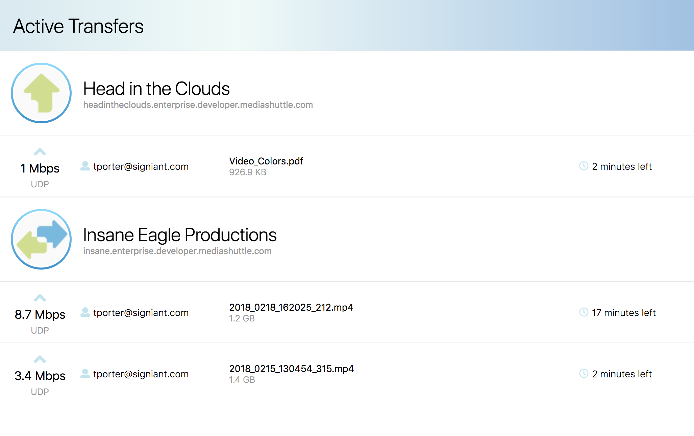

# Media Shuttle Active Transfers App

A sample React web application demonstrating the use of the [Media Shuttle Management API](http://developer.signiant.com/apis/mediashuttle/)
to view active transfers for a Media Shuttle account.

Build with [create-react-app](https://github.com/facebook/create-react-app).



## Getting Started

Clone this repo and install the application dependencies

```
npm install

```

Log into the [Media Shuttle Management console](https://manage.mediashuttle.com/#) and copy your Media Shuttle **API Key**
by selecting the Developer menu item under the user profile menu.

Replace the placeholder text for **apiKey** in the `config.json` file located in the `src` folder with the API Key for
your account. Alternatively, you can just supply your API Key via the **apiKey** query string parameter when launching the application.

## Running the Application

The development server that comes with create-react-app can be used to serve the application.

```
npm start

```

The application will be served at `http://localhost:3000`.
